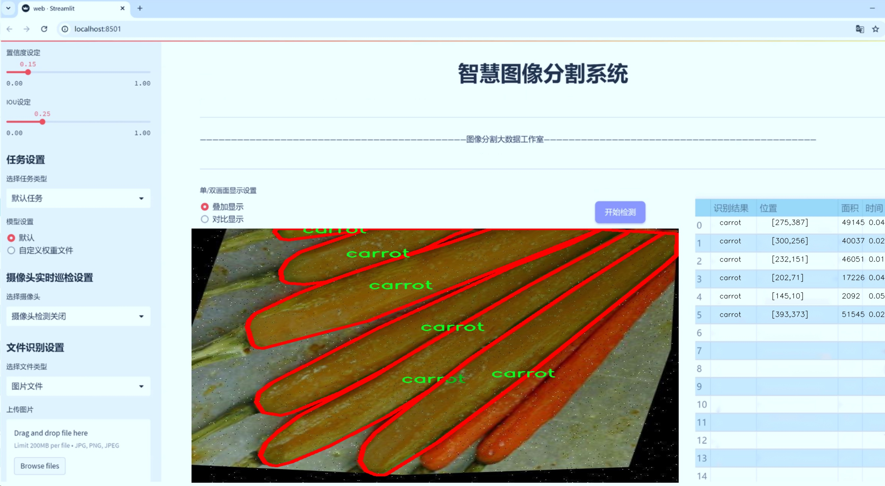
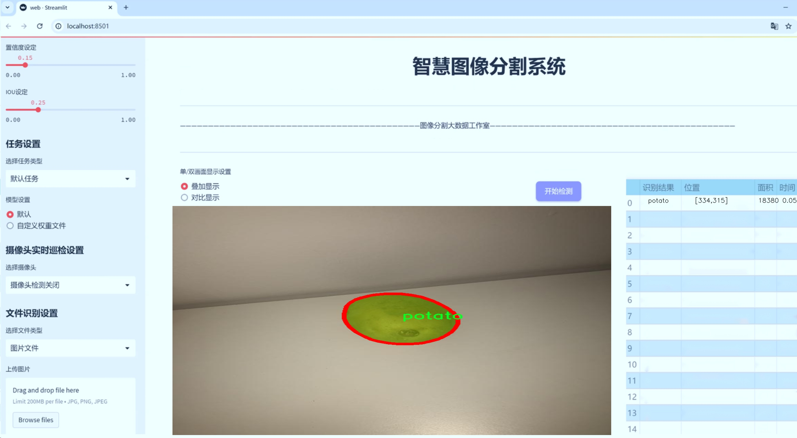
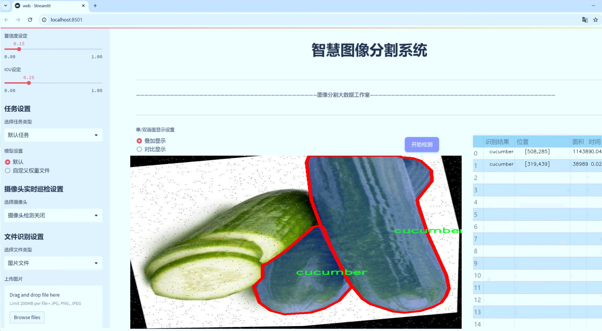
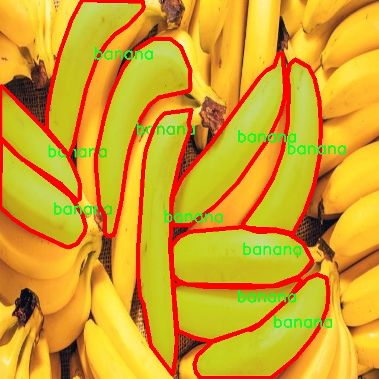
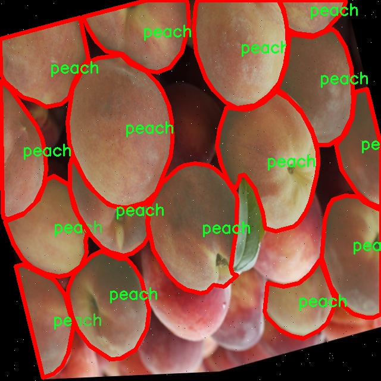
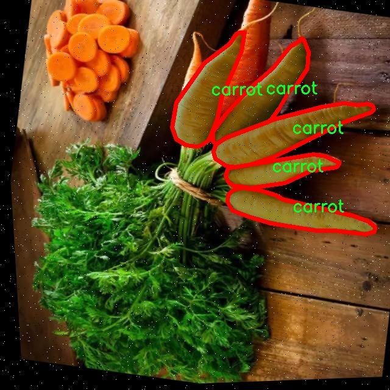
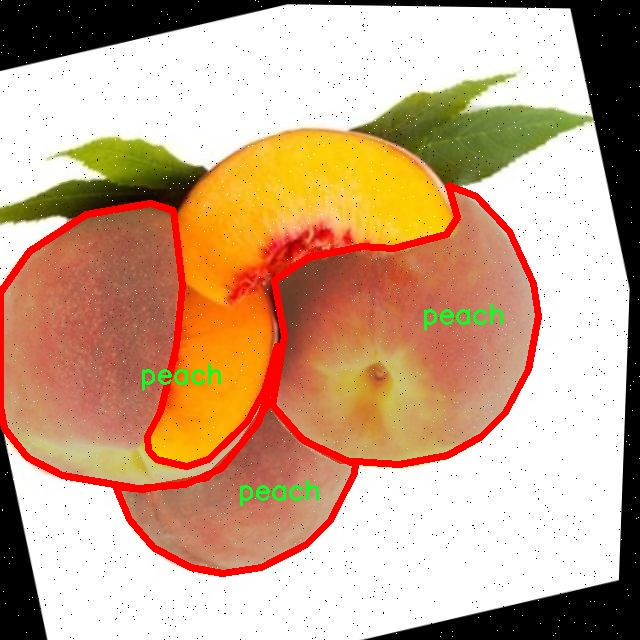
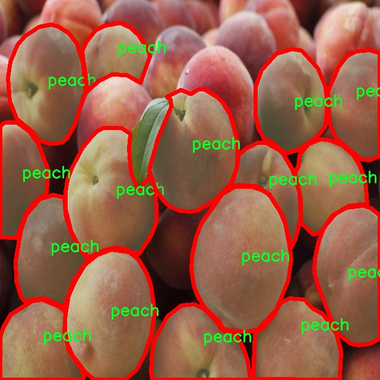

# 水果图像分割系统： yolov8-seg-C2f-DCNV3

### 1.研究背景与意义

[参考博客](https://gitee.com/YOLOv8_YOLOv11_Segmentation_Studio/projects)

[博客来源](https://kdocs.cn/l/cszuIiCKVNis)

研究背景与意义

随着全球经济的快速发展和人们生活水平的提高，水果和蔬菜的消费需求日益增长，促进了农业生产和供应链的现代化。与此同时，图像处理技术的进步为农业智能化提供了新的可能性，尤其是在水果和蔬菜的自动识别与分割方面。传统的人工识别方法不仅效率低下，而且容易受到人为因素的影响，导致识别准确率低。因此，基于深度学习的图像分割技术逐渐成为研究的热点，尤其是YOLO（You Only Look Once）系列模型因其实时性和高效性而备受关注。

YOLOv8作为YOLO系列的最新版本，进一步优化了目标检测和分割的性能，具备了更强的特征提取能力和更高的处理速度。通过改进YOLOv8模型，我们可以实现对水果图像的高效分割，进而为农业生产、物流管理及智能零售等领域提供支持。尤其是在图像分割的应用中，准确的分割结果不仅可以提高后续处理的效率，还能为农业智能化决策提供重要的数据基础。

本研究所使用的数据集包含1000张图像，涵盖了9种不同类别的水果和蔬菜，包括苹果、香蕉、胡萝卜、黄瓜、桃子、辣椒、土豆、西红柿和西瓜。这些类别的选择不仅丰富了研究的多样性，也反映了市场上常见的水果和蔬菜种类，具有较高的实用价值。通过对这些图像进行实例分割，可以实现对每种水果和蔬菜的精确定位和识别，为后续的智能化处理提供可靠的数据支持。

在实际应用中，水果图像分割系统可以广泛应用于农业监测、智能仓储、无人驾驶配送等场景。例如，在农业监测中，系统可以实时监测果园中的水果生长情况，帮助农民及时掌握作物的生长状态，优化管理决策；在智能仓储中，系统可以自动识别和分类入库的水果，提高仓储效率；在无人驾驶配送中，系统可以确保配送车辆准确识别和避让水果摊位，提升配送安全性。

此外，随着深度学习技术的不断发展，基于改进YOLOv8的水果图像分割系统的研究不仅具有理论意义，还具备广泛的应用前景。通过对图像分割技术的深入研究，可以推动农业领域的智能化转型，提升生产效率，降低人力成本，最终实现可持续发展目标。

综上所述，基于改进YOLOv8的水果图像分割系统的研究，不仅具有重要的学术价值，也为农业现代化提供了新的思路和方法。通过本研究，我们期望能够为水果和蔬菜的智能识别与分割提供有效的解决方案，推动相关领域的进一步发展。

### 2.图片演示







注意：本项目提供完整的训练源码数据集和训练教程,由于此博客编辑较早,暂不提供权重文件（best.pt）,需要按照6.训练教程进行训练后实现上图效果。

### 3.视频演示

[3.1 视频演示](https://www.bilibili.com/video/BV1MbmRYbEQm/)

### 4.数据集信息

##### 4.1 数据集类别数＆类别名

nc: 9
names: ['apple', 'banana', 'carrot', 'cucumber', 'peach', 'pepper', 'potato', 'tomato', 'watermelon']


##### 4.2 数据集信息简介

数据集信息展示

在本研究中，我们采用了名为“third”的数据集，以支持对YOLOv8-seg模型的训练与改进，专注于水果及蔬菜的图像分割任务。该数据集包含了九个类别，涵盖了多种常见的水果和蔬菜，具体类别包括：苹果、香蕉、胡萝卜、黄瓜、桃子、辣椒、土豆、西红柿和西瓜。这些类别的选择不仅丰富了数据集的多样性，也为模型的训练提供了广泛的应用场景。

“third”数据集的构建考虑到了实际应用中的多样性和复杂性，图像样本均来自于自然环境中的真实场景，涵盖了不同的光照条件、背景杂乱程度以及不同的拍摄角度。这种多样性确保了模型在实际应用中的鲁棒性，使其能够在不同的环境中有效地进行水果和蔬菜的分割。每个类别的图像都经过精心标注，确保了数据的准确性和高质量，标注信息包括物体的边界框和精确的分割掩码，这对于YOLOv8-seg模型的训练至关重要。

在数据集的设计上，类别的选择也反映了市场需求和消费者偏好。苹果和香蕉作为最受欢迎的水果之一，胡萝卜和黄瓜则是常见的蔬菜，桃子、辣椒、西红柿和西瓜则为数据集增添了更多的多样性。这些类别的组合不仅使得数据集在视觉特征上呈现出丰富的变化，也为后续的模型评估提供了良好的基础。

为了确保模型的训练效果，我们在数据集中采取了数据增强技术，包括旋转、缩放、翻转等操作，以增加样本的多样性和数量。这些增强技术的应用使得模型能够更好地学习到不同类别之间的特征差异，从而提高其分割精度和泛化能力。此外，数据集的划分也经过精心设计，确保训练集、验证集和测试集的比例合理，以便于模型性能的评估和优化。

在模型训练过程中，我们将使用“third”数据集进行多轮次的训练和验证，以不断调整模型参数，优化分割效果。通过对不同类别的分析，我们期望能够识别出每种水果和蔬菜的独特特征，从而提升YOLOv8-seg在图像分割任务中的表现。最终，我们希望通过这一数据集的有效利用，推动水果和蔬菜图像分割技术的发展，为相关领域的应用提供更加精准和高效的解决方案。

综上所述，“third”数据集不仅为本研究提供了丰富的训练素材，也为改进YOLOv8-seg模型的图像分割能力奠定了坚实的基础。通过对该数据集的深入分析和应用，我们期待能够在水果和蔬菜的自动识别与分割领域取得显著的进展。











### 5.项目依赖环境部署教程（零基础手把手教学）

[5.1 环境部署教程链接（零基础手把手教学）](https://www.bilibili.com/video/BV1jG4Ve4E9t/?vd_source=bc9aec86d164b67a7004b996143742dc)


[5.2 安装Python虚拟环境创建和依赖库安装视频教程链接（零基础手把手教学）](https://www.bilibili.com/video/BV1nA4VeYEze/?vd_source=bc9aec86d164b67a7004b996143742dc)

### 6.手把手YOLOV8-seg训练视频教程（零基础手把手教学）

[6.1 手把手YOLOV8-seg训练视频教程（零基础小白有手就能学会）](https://www.bilibili.com/video/BV1cA4VeYETe/?vd_source=bc9aec86d164b67a7004b996143742dc)


按照上面的训练视频教程链接加载项目提供的数据集，运行train.py即可开始训练



     Epoch   gpu_mem       box       obj       cls    labels  img_size
     1/200     0G   0.01576   0.01955  0.007536        22      1280: 100%|██████████| 849/849 [14:42<00:00,  1.04s/it]
               Class     Images     Labels          P          R     mAP@.5 mAP@.5:.95: 100%|██████████| 213/213 [01:14<00:00,  2.87it/s]
                 all       3395      17314      0.994      0.957      0.0957      0.0843

     Epoch   gpu_mem       box       obj       cls    labels  img_size
     2/200     0G   0.01578   0.01923  0.007006        22      1280: 100%|██████████| 849/849 [14:44<00:00,  1.04s/it]
               Class     Images     Labels          P          R     mAP@.5 mAP@.5:.95: 100%|██████████| 213/213 [01:12<00:00,  2.95it/s]
                 all       3395      17314      0.996      0.956      0.0957      0.0845

     Epoch   gpu_mem       box       obj       cls    labels  img_size
     3/200     0G   0.01561    0.0191  0.006895        27      1280: 100%|██████████| 849/849 [10:56<00:00,  1.29it/s]
               Class     Images     Labels          P          R     mAP@.5 mAP@.5:.95: 100%|███████   | 187/213 [00:52<00:00,  4.04it/s]
                 all       3395      17314      0.996      0.957      0.0957      0.0845


### 7.50+种全套YOLOV8-seg创新点加载调参实验视频教程（一键加载写好的改进模型的配置文件）

[7.1 50+种全套YOLOV8-seg创新点加载调参实验视频教程（一键加载写好的改进模型的配置文件）](https://www.bilibili.com/video/BV1Hw4VePEXv/?vd_source=bc9aec86d164b67a7004b996143742dc)

### YOLOV8-seg算法简介

原始YOLOV8-seg算法原理

YOLO（You Only Look Once）系列算法自2015年问世以来，经历了多个版本的迭代与更新，逐步发展成为目标检测领域的佼佼者。2023年1月，Ultralytics发布了YOLOv8，作为该系列的最新版本，YOLOv8在多个方面进行了创新和优化，尤其是在模型结构、损失函数以及数据增强策略等方面，进一步提升了目标检测的精度和速度。YOLOv8-seg作为YOLOv8的一个重要变种，专注于图像分割任务，结合了目标检测与语义分割的优点，展现出更为强大的视觉识别能力。

YOLOv8-seg的网络结构主要由输入端、主干网络（Backbone）、颈部结构（Neck）和检测头（Head）四个部分组成。输入端负责接收原始图像数据，经过一定的预处理后，将其送入主干网络进行特征提取。主干网络的设计灵活多样，YOLOv8提供了五种不同尺度的模型（n、s、m、l、x），以适应不同场景的需求。这些模型在深度、宽度和特征图的尺度上各有不同，能够根据具体应用的性能需求进行选择。以YOLOv8n为例，其网络结构经过精心设计，采用了较小的卷积核和步长设置，以实现高效的特征提取。

在YOLOv8的创新中，PAN-FPN（Path Aggregation Network - Feature Pyramid Network）结构依然被沿用，但在此基础上进行了改进。YOLOv8中去除了上采样部分的卷积结构，替换为新的C2f模块。C2f模块的设计灵感来源于YOLOv5中的C3模块与YOLOv7中的ELAN模块的结合，增加了更多的残差连接，极大地丰富了梯度信息的流动。这种结构的优化不仅提升了模型的学习能力，也在一定程度上减轻了计算负担，使得YOLOv8在保持高精度的同时实现了轻量化。

在Head部分，YOLOv8采用了当前流行的解耦合头结构，将分类和检测任务分开处理。这种设计的好处在于，分类头和检测头可以独立优化，从而提高了模型的整体性能。此外，YOLOv8还将传统的Anchor-Based方法替换为Anchor-Free策略，进一步简化了模型的复杂性，提高了训练和推理的效率。通过这种解耦合的设计，YOLOv8-seg能够更灵活地适应不同的目标检测和分割任务。

在训练过程中，YOLOv8-seg引入了一系列先进的数据增强技术，以提高模型的泛化能力。其中，动态Task-Aligned Assigner样本分配策略的使用，使得模型在训练过程中能够更有效地分配样本，从而提升了训练效率。此外，YOLOv8在最后10个epoch中关闭了马赛克增强，避免了过度增强对模型训练的负面影响。这些数据增强策略的应用，使得YOLOv8-seg在面对复杂场景时，依然能够保持较高的检测精度。

损失函数的设计是YOLOv8-seg的一大亮点。模型采用了BCELoss作为分类损失，DFLLoss和CIoULoss作为回归损失，这种多重损失函数的组合使得模型在分类和定位任务上都能得到良好的优化。BCELoss能够有效处理二分类问题，而DFLLoss和CIoULoss则在回归任务中提供了更为精确的损失反馈，帮助模型更好地学习目标的边界和位置。

YOLOv8-seg的优势不仅体现在其高效的网络结构和创新的训练策略上，还在于其出色的实时检测能力。与之前的YOLO版本相比，YOLOv8在推理速度和精度上均有显著提升，使其在实际应用中表现得更加优异。这一特性使得YOLOv8-seg在自动化视觉识别领域，尤其是在农业、工业和智能监控等场景中，展现出广泛的应用前景。

在具体应用中，YOLOv8-seg可以被用于苹果采摘等任务，通过其强大的视觉识别能力，自动检测和定位目标对象。这种应用不仅提高了采摘效率，还降低了人工成本，推动了农业自动化的发展。此外，结合蚁群算法进行路径规划，可以进一步优化采摘机器人的工作流程，使其在复杂环境中能够快速而准确地完成任务。

总之，YOLOv8-seg作为YOLO系列的最新进展，凭借其创新的网络结构、灵活的模型选择和高效的训练策略，展现出卓越的性能。它不仅为目标检测和图像分割任务提供了新的解决方案，也为相关领域的研究和应用开辟了新的方向。随着YOLOv8-seg的不断发展和完善，未来在视觉识别领域的应用将更加广泛，推动智能化技术的进一步普及与发展。


### 9.系统功能展示（检测对象为举例，实际内容以本项目数据集为准）

图9.1.系统支持检测结果表格显示

  图9.2.系统支持置信度和IOU阈值手动调节

  图9.3.系统支持自定义加载权重文件best.pt(需要你通过步骤5中训练获得)

  图9.4.系统支持摄像头实时识别

  图9.5.系统支持图片识别

  图9.6.系统支持视频识别

  图9.7.系统支持识别结果文件自动保存

  图9.8.系统支持Excel导出检测结果数据


### 10.50+种全套YOLOV8-seg创新点原理讲解（非科班也可以轻松写刊发刊，V11版本正在科研待更新）

#### 10.1 由于篇幅限制，每个创新点的具体原理讲解就不一一展开，具体见下列网址中的创新点对应子项目的技术原理博客网址【Blog】：


[10.1 50+种全套YOLOV8-seg创新点原理讲解链接](https://gitee.com/qunmasj/good)

#### 10.2 部分改进模块原理讲解(完整的改进原理见上图和技术博客链接)【如果此小节的图加载失败可以通过CSDN或者Github搜索该博客的标题访问原始博客，原始博客图片显示正常】

### Gold-YOLO简介
YOLO再升级：华为诺亚提出Gold-YOLO，聚集-分发机制打造新SOTA
在过去的几年中，YOLO系列模型已经成为实时目标检测领域的领先方法。许多研究通过修改架构、增加数据和设计新的损失函数，将基线推向了更高的水平。然而以前的模型仍然存在信息融合问题，尽管特征金字塔网络（FPN）和路径聚合网络（PANet）已经在一定程度上缓解了这个问题。因此，本研究提出了一种先进的聚集和分发机制（GD机制），该机制通过卷积和自注意力操作实现。这种新设计的模型被称为Gold-YOLO，它提升了多尺度特征融合能力，在所有模型尺度上实现了延迟和准确性的理想平衡。此外，本文首次在YOLO系列中实现了MAE风格的预训练，使得YOLO系列模型能够从无监督预训练中受益。Gold-YOLO-N在COCO val2017数据集上实现了出色的39.9% AP，并在T4 GPU上实现了1030 FPS，超过了之前的SOTA模型YOLOv6-3.0-N，其FPS相似，但性能提升了2.4%。


#### Gold-YOLO


YOLO系列的中间层结构采用了传统的FPN结构，其中包含多个分支用于多尺度特征融合。然而，它只充分融合来自相邻级别的特征，对于其他层次的信息只能间接地进行“递归”获取。

传统的FPN结构在信息传输过程中存在丢失大量信息的问题。这是因为层之间的信息交互仅限于中间层选择的信息，未被选择的信息在传输过程中被丢弃。这种情况导致某个Level的信息只能充分辅助相邻层，而对其他全局层的帮助较弱。因此，整体上信息融合的有效性可能受到限制。
为了避免在传输过程中丢失信息，本文采用了一种新颖的“聚集和分发”机制（GD），放弃了原始的递归方法。该机制使用一个统一的模块来收集和融合所有Level的信息，并将其分发到不同的Level。通过这种方式，作者不仅避免了传统FPN结构固有的信息丢失问题，还增强了中间层的部分信息融合能力，而且并没有显著增加延迟。


# 8.低阶聚合和分发分支 Low-stage gather-and-distribute branch
从主干网络中选择输出的B2、B3、B4、B5特征进行融合，以获取保留小目标信息的高分辨率特征。


低阶特征对齐模块 (Low-stage feature alignment module)： 在低阶特征对齐模块（Low-FAM）中，采用平均池化（AvgPool）操作对输入特征进行下采样，以实现统一的大小。通过将特征调整为组中最小的特征大小（ R B 4 = 1 / 4 R ） （R_{B4} = 1/4R）（R 
B4 =1/4R），我们得到对齐后的特征F a l i g n F_{align}F align 。低阶特征对齐技术确保了信息的高效聚合，同时通过变换器模块来最小化后续处理的计算复杂性。其中选择 R B 4 R_{B4}R B4 作为特征对齐的目标大小主要基于保留更多的低层信息的同时不会带来较大的计算延迟。
低阶信息融合模块(Low-stage information fusion module)： 低阶信息融合模块（Low-IFM）设计包括多层重新参数化卷积块（RepBlock）和分裂操作。具体而言，RepBlock以F a l i g n ( c h a n n e l = s u m ( C B 2 ， C B 3 ， C B 4 ， C B 5 ) ) F_{align} (channel= sum(C_{B2}，C_{B3}，C_{B4}，C_{B5}))F align (channel=sum(C B2 ，C B3 ，C B4 ，C B5 )作为输入，并生成F f u s e ( c h a n n e l = C B 4 + C B 5 ) F_{fuse} (channel= C_{B4} + C_{B5})F fuse (channel=C B4 +C B5 )。其中中间通道是一个可调整的值（例如256），以适应不同的模型大小。由RepBlock生成的特征随后在通道维度上分裂为F i n j P 3 Finj_P3Finj P 3和F i n j P 4 Finj_P4Finj P 4，然后与不同级别的特征进行融合。


# 8.高阶聚合和分发分支 High-stage gather-and-distribute branch
高级全局特征对齐模块（High-GD）将由低级全局特征对齐模块（Low-GD）生成的特征{P3, P4, P5}进行融合。


高级特征对齐模块(High-stage feature alignment module)： High-FAM由avgpool组成，用于将输入特征的维度减小到统一的尺寸。具体而言，当输入特征的尺寸为{R P 3 R_{P3}R P3 , R P 4 R_{P4}R P4 , R P 5 R_{P 5}R P5 }时，avgpool将特征尺寸减小到该特征组中最小的尺寸（R P 5 R_{P5}R P5  = 1/8R）。由于transformer模块提取了高层次的信息，池化操作有助于信息聚合，同时降低了transformer模块后续步骤的计算需求。

Transformer融合模块由多个堆叠的transformer组成，transformer块的数量为L。每个transformer块包括一个多头注意力块、一个前馈网络（FFN）和残差连接。采用与LeViT相同的设置来配置多头注意力块，使用16个通道作为键K和查询Q的头维度，32个通道作为值V的头维度。为了加速推理过程，将层归一化操作替换为批归一化，并将所有的GELU激活函数替换为ReLU。为了增强变换器块的局部连接，在两个1x1卷积层之间添加了一个深度卷积层。同时，将FFN的扩展因子设置为2，以在速度和计算成本之间取得平衡。

信息注入模块(Information injection module)： 高级全局特征对齐模块（High-GD）中的信息注入模块与低级全局特征对齐模块（Low-GD）中的相同。在高级阶段，局部特征（Flocal）等于Pi，因此公式如下所示：


### 增强的跨层信息流动 Enhanced cross-layer information flow
为了进一步提升性能，从YOLOv8 中的PAFPN模块中得到启发，引入了Inject-LAF模块。该模块是注入模块的增强版，包括了一个轻量级相邻层融合（LAF）模块，该模块被添加到注入模块的输入位置。为了在速度和准确性之间取得平衡，设计了两个LAF模型：LAF低级模型和LAF高级模型，分别用于低级注入（合并相邻两层的特征）和高级注入（合并相邻一层的特征）。它们的结构如图5(b)所示。为了确保来自不同层级的特征图与目标大小对齐，在实现中的两个LAF模型仅使用了三个操作符：双线性插值（上采样过小的特征）、平均池化（下采样过大的特征）和1x1卷积（调整与目标通道不同的特征）。模型中的LAF模块与信息注入模块的结合有效地平衡了准确性和速度之间的关系。通过使用简化的操作，能够增加不同层级之间的信息流路径数量，从而提高性能而不显著增加延迟。


### 11.项目核心源码讲解（再也不用担心看不懂代码逻辑）

#### 11.1 chinese_name_list.py

以下是对给定代码的逐行分析，并保留了核心部分，同时添加了详细的中文注释：

```python
# -*- coding: utf-8 -*-  # 指定文件编码为UTF-8，以支持中文字符

# 创建一个字典，键为英文单词，值为对应的中文翻译
Chinese_name = {'person': "人"}

# 从字典中提取所有的中文翻译，生成一个列表
Label_list = list(Chinese_name.values())
```

### 核心部分分析
1. **字典的创建**：`Chinese_name`字典用于存储英文单词及其对应的中文翻译。在这个例子中，只有一个键值对，表示“person”对应的中文是“人”。

2. **列表的生成**：`Label_list`通过`list(Chinese_name.values())`将字典中的所有值提取出来并转换为列表。在这个例子中，`Label_list`将包含一个元素，即“人”。

### 总结
这段代码的核心功能是创建一个英文到中文的映射，并将所有中文翻译提取到一个列表中。

这个程序文件的名称是 `chinese_name_list.py`，它的主要功能是定义一个包含中文名称的字典，并从中提取出值列表。

首先，文件的开头有一行注释 `# -*- coding: utf-8 -*-`，这行代码指定了文件的编码格式为 UTF-8。这是为了确保文件能够正确处理和显示中文字符。

接下来，定义了一个字典 `Chinese_name`，其中包含一个键值对。键是字符串 `"person"`，对应的值是中文字符 `"人"`。这个字典的设计意图可能是为了将某些英文词汇与其中文翻译进行对应。

然后，使用 `list(Chinese_name.values())` 这行代码从字典中提取出所有的值，并将它们转换成一个列表。这里的 `Label_list` 就是一个包含字典中所有值的列表。在这个例子中，`Label_list` 将会是 `["人"]`，因为字典中只有一个值。

总的来说，这个文件的作用是创建一个简单的中文名称映射，并将其值提取为列表，便于后续的使用。这个结构可以为后续的程序提供中文标签，方便进行国际化或本地化处理。

#### 11.2 ultralytics\utils\callbacks\__init__.py

以下是代码中最核心的部分，并附上详细的中文注释：

```python
# 导入基础模块中的函数
from .base import add_integration_callbacks, default_callbacks, get_default_callbacks

# 定义模块的公开接口，指定可以被外部访问的函数
__all__ = 'add_integration_callbacks', 'default_callbacks', 'get_default_callbacks'
```

### 详细注释：

1. `from .base import add_integration_callbacks, default_callbacks, get_default_callbacks`：
   - 这一行代码从当前包的 `base` 模块中导入了三个函数：`add_integration_callbacks`、`default_callbacks` 和 `get_default_callbacks`。
   - `.` 表示当前模块，`base` 是一个子模块，使用这种方式可以在包内部组织代码。

2. `__all__ = 'add_integration_callbacks', 'default_callbacks', 'get_default_callbacks'`：
   - 这一行定义了模块的 `__all__` 变量，指定了当使用 `from module import *` 语句时，哪些名称是可以被导入的。
   - 通过定义 `__all__`，可以控制模块的公共接口，隐藏不希望暴露给外部的内容，提高模块的封装性和可维护性。

这个程序文件是一个Python模块，属于Ultralytics YOLO项目的一部分，遵循AGPL-3.0许可证。文件的主要功能是导入和管理回调函数，这些回调函数在训练和推理过程中起到重要作用。

首先，文件中使用了相对导入的方式，从同一包内的`base`模块中导入了三个函数：`add_integration_callbacks`、`default_callbacks`和`get_default_callbacks`。这些函数的具体功能可能与回调的集成、默认回调的设置以及获取默认回调有关，尽管在这个文件中并没有提供这些函数的具体实现。

接下来，文件定义了`__all__`变量，这个变量是一个字符串元组，列出了该模块公开的接口。通过定义`__all__`，用户在使用`from module import *`语句时，只会导入这些指定的函数，避免了不必要的命名冲突和混乱。

总的来说，这个文件的作用是作为一个接口，提供回调函数的导入和管理，方便其他模块或文件使用这些功能。

#### 11.3 ultralytics\models\yolo\detect\train.py

以下是代码中最核心的部分，并附上详细的中文注释：

```python
class DetectionTrainer(BaseTrainer):
    """
    扩展自 BaseTrainer 类的检测模型训练类。
    用于训练 YOLO 检测模型。
    """

    def build_dataset(self, img_path, mode='train', batch=None):
        """
        构建 YOLO 数据集。

        参数:
            img_path (str): 包含图像的文件夹路径。
            mode (str): 模式，'train' 或 'val'，用户可以为每种模式自定义不同的数据增强。
            batch (int, optional): 批次大小，仅在 'rect' 模式下使用。默认为 None。
        """
        gs = max(int(de_parallel(self.model).stride.max() if self.model else 0), 32)  # 获取模型的最大步幅
        return build_yolo_dataset(self.args, img_path, batch, self.data, mode=mode, rect=mode == 'val', stride=gs)

    def get_dataloader(self, dataset_path, batch_size=16, rank=0, mode='train'):
        """构建并返回数据加载器。"""
        assert mode in ['train', 'val']  # 确保模式有效
        with torch_distributed_zero_first(rank):  # 在分布式环境中，仅初始化数据集一次
            dataset = self.build_dataset(dataset_path, mode, batch_size)  # 构建数据集
        shuffle = mode == 'train'  # 训练模式下打乱数据
        if getattr(dataset, 'rect', False) and shuffle:
            LOGGER.warning("WARNING ⚠️ 'rect=True' 与 DataLoader shuffle 不兼容，设置 shuffle=False")
            shuffle = False
        workers = self.args.workers if mode == 'train' else self.args.workers * 2  # 设置工作线程数
        return build_dataloader(dataset, batch_size, workers, shuffle, rank)  # 返回数据加载器

    def preprocess_batch(self, batch):
        """对图像批次进行预处理，缩放并转换为浮点数。"""
        batch['img'] = batch['img'].to(self.device, non_blocking=True).float() / 255  # 将图像转换为浮点数并归一化
        return batch

    def set_model_attributes(self):
        """设置模型的属性，包括类别数量和名称。"""
        self.model.nc = self.data['nc']  # 将类别数量附加到模型
        self.model.names = self.data['names']  # 将类别名称附加到模型
        self.model.args = self.args  # 将超参数附加到模型

    def get_model(self, cfg=None, weights=None, verbose=True):
        """返回 YOLO 检测模型。"""
        model = DetectionModel(cfg, nc=self.data['nc'], verbose=verbose and RANK == -1)  # 创建检测模型
        if weights:
            model.load(weights)  # 加载权重
        return model

    def get_validator(self):
        """返回用于 YOLO 模型验证的 DetectionValidator。"""
        self.loss_names = 'box_loss', 'cls_loss', 'dfl_loss'  # 定义损失名称
        return yolo.detect.DetectionValidator(self.test_loader, save_dir=self.save_dir, args=copy(self.args))

    def plot_training_samples(self, batch, ni):
        """绘制带有注释的训练样本。"""
        plot_images(images=batch['img'],
                    batch_idx=batch['batch_idx'],
                    cls=batch['cls'].squeeze(-1),
                    bboxes=batch['bboxes'],
                    paths=batch['im_file'],
                    fname=self.save_dir / f'train_batch{ni}.jpg',
                    on_plot=self.on_plot)

    def plot_metrics(self):
        """从 CSV 文件中绘制指标。"""
        plot_results(file=self.csv, on_plot=self.on_plot)  # 保存结果图像
```

### 代码核心部分说明：
1. **DetectionTrainer 类**：这是一个用于训练 YOLO 检测模型的类，继承自 `BaseTrainer`。
2. **build_dataset 方法**：构建数据集，支持训练和验证模式，允许用户自定义数据增强。
3. **get_dataloader 方法**：构建数据加载器，确保在分布式训练中只初始化一次数据集。
4. **preprocess_batch 方法**：对图像批次进行预处理，将图像转换为浮点数并归一化。
5. **set_model_attributes 方法**：设置模型的类别数量和名称等属性。
6. **get_model 方法**：返回一个 YOLO 检测模型，可以选择加载预训练权重。
7. **get_validator 方法**：返回用于模型验证的验证器。
8. **plot_training_samples 和 plot_metrics 方法**：用于可视化训练样本和训练指标。

这个程序文件是Ultralytics YOLO（You Only Look Once）模型的训练模块，主要用于目标检测任务。文件中定义了一个名为`DetectionTrainer`的类，该类继承自`BaseTrainer`，并提供了一系列方法来构建数据集、获取数据加载器、预处理批次数据、设置模型属性、获取模型、进行验证、记录损失、输出训练进度、绘制训练样本和绘制训练指标等功能。

在`DetectionTrainer`类中，`build_dataset`方法用于构建YOLO数据集。它接收图像路径、模式（训练或验证）和批次大小作为参数，并调用`build_yolo_dataset`函数来创建数据集。`get_dataloader`方法则负责构建并返回数据加载器，确保在分布式训练时只初始化一次数据集，并根据模式设置是否打乱数据。

`preprocess_batch`方法用于对批次图像进行预处理，将图像数据转换为浮点数并进行归一化。`set_model_attributes`方法则将数据集的类别数量和类别名称等信息附加到模型上，以便于后续训练。

`get_model`方法用于返回一个YOLO检测模型，可以加载指定的权重。`get_validator`方法返回一个用于模型验证的`DetectionValidator`实例，并设置损失名称。

`label_loss_items`方法用于返回带有标签的训练损失项字典，适用于目标检测任务。`progress_string`方法返回一个格式化的字符串，显示训练进度，包括当前的轮次、GPU内存使用情况、损失值、实例数量和图像大小等信息。

`plot_training_samples`方法用于绘制训练样本及其标注，便于可视化训练过程中的数据。最后，`plot_metrics`和`plot_training_labels`方法分别用于绘制训练过程中的指标和标注图，帮助用户分析模型的训练效果。

总体来说，这个文件提供了YOLO模型训练的核心功能，涵盖了数据处理、模型构建、训练过程监控和结果可视化等多个方面，便于用户进行目标检测任务的训练和评估。

#### 11.4 ultralytics\engine\predictor.py

以下是代码中最核心的部分，并附上详细的中文注释：

```python
class BasePredictor:
    """
    BasePredictor类用于创建预测器的基类。

    属性:
        args (SimpleNamespace): 预测器的配置。
        save_dir (Path): 保存结果的目录。
        model (nn.Module): 用于预测的模型。
        device (torch.device): 用于预测的设备。
        dataset (Dataset): 用于预测的数据集。
    """

    def __init__(self, cfg=DEFAULT_CFG, overrides=None, _callbacks=None):
        """
        初始化BasePredictor类。

        参数:
            cfg (str, optional): 配置文件的路径，默认为DEFAULT_CFG。
            overrides (dict, optional): 配置覆盖，默认为None。
        """
        self.args = get_cfg(cfg, overrides)  # 获取配置
        self.save_dir = get_save_dir(self.args)  # 获取保存目录
        self.done_warmup = False  # 是否完成模型预热
        self.model = None  # 初始化模型为None
        self.device = None  # 初始化设备为None
        self.dataset = None  # 初始化数据集为None
        self.callbacks = _callbacks or callbacks.get_default_callbacks()  # 初始化回调函数

    def preprocess(self, im):
        """
        在推理之前准备输入图像。

        参数:
            im (torch.Tensor | List(np.ndarray)): 输入图像，支持Tensor或列表格式。
        
        返回:
            torch.Tensor: 处理后的图像张量。
        """
        not_tensor = not isinstance(im, torch.Tensor)  # 检查输入是否为Tensor
        if not_tensor:
            im = np.stack(self.pre_transform(im))  # 预处理图像
            im = im[..., ::-1].transpose((0, 3, 1, 2))  # BGR转RGB，调整维度
            im = np.ascontiguousarray(im)  # 确保数组是连续的
            im = torch.from_numpy(im)  # 转换为Tensor

        im = im.to(self.device)  # 将图像移动到指定设备
        im = im.half() if self.model.fp16 else im.float()  # 转换数据类型
        if not_tensor:
            im /= 255  # 将像素值归一化到0.0 - 1.0
        return im

    def inference(self, im, *args, **kwargs):
        """对给定图像运行推理。"""
        return self.model(im, augment=self.args.augment)  # 使用模型进行推理

    def __call__(self, source=None, model=None, stream=False, *args, **kwargs):
        """对图像或流执行推理。"""
        self.stream = stream
        if stream:
            return self.stream_inference(source, model, *args, **kwargs)  # 流推理
        else:
            return list(self.stream_inference(source, model, *args, **kwargs))  # 非流推理

    def stream_inference(self, source=None, model=None, *args, **kwargs):
        """对摄像头输入进行实时推理并将结果保存到文件。"""
        if not self.model:
            self.setup_model(model)  # 设置模型

        self.setup_source(source if source is not None else self.args.source)  # 设置数据源

        # 预热模型
        if not self.done_warmup:
            self.model.warmup(imgsz=(1, 3, *self.imgsz))  # 预热模型
            self.done_warmup = True

        for batch in self.dataset:  # 遍历数据集
            path, im0s, vid_cap, s = batch  # 获取批次数据
            im = self.preprocess(im0s)  # 预处理图像
            preds = self.inference(im, *args, **kwargs)  # 进行推理
            self.results = self.postprocess(preds, im, im0s)  # 后处理结果

            # 可视化、保存和写入结果
            for i in range(len(im0s)):
                self.write_results(i, self.results, (path[i], im, im0s[i]))  # 写入结果

            yield from self.results  # 生成结果

    def setup_model(self, model, verbose=True):
        """使用给定参数初始化YOLO模型并设置为评估模式。"""
        self.model = AutoBackend(model or self.args.model, device=select_device(self.args.device, verbose=verbose))
        self.device = self.model.device  # 更新设备
        self.model.eval()  # 设置模型为评估模式

    def write_results(self, idx, results, batch):
        """将推理结果写入文件或目录。"""
        p, im, _ = batch  # 获取批次数据
        result = results[idx]  # 获取当前结果
        # 保存结果逻辑
        if self.args.save_txt:
            result.save_txt(f'{self.txt_path}.txt', save_conf=self.args.save_conf)  # 保存文本结果
        return f'{idx}: {result.verbose()}'  # 返回日志字符串
```

### 代码说明：
1. **BasePredictor类**：这是一个基类，用于处理图像或视频的推理。它包含了模型的初始化、预处理、推理、后处理等功能。
2. **__init__方法**：初始化配置、保存目录、模型、设备等。
3. **preprocess方法**：对输入图像进行预处理，包括归一化和维度调整。
4. **inference方法**：使用模型对图像进行推理。
5. **__call__方法**：允许实例像函数一样被调用，执行推理。
6. **stream_inference方法**：处理实时推理，遍历数据集并生成结果。
7. **setup_model方法**：初始化YOLO模型并设置为评估模式。
8. **write_results方法**：将推理结果写入文件或目录。

通过这些核心部分的实现，`BasePredictor`类能够有效地进行图像或视频的目标检测和结果处理。

这个程序文件 `ultralytics/engine/predictor.py` 是一个用于执行图像、视频等数据源的预测的基础类。它主要实现了对 YOLO（You Only Look Once）模型的推理功能，能够处理多种输入源，包括摄像头、图片、视频、目录、流媒体等。

文件的开头部分包含了使用说明，详细列出了可以作为输入源的不同类型，例如摄像头（source=0）、图片文件（img.jpg）、视频文件（vid.mp4）、YouTube 链接等。同时，它也列出了支持的模型格式，如 PyTorch、ONNX、TensorRT 等。

在类 `BasePredictor` 中，构造函数 `__init__` 初始化了一些基本属性，包括配置参数、保存结果的目录、模型、数据集等。它还设置了一些默认值，例如置信度阈值为 0.25，并检查是否需要显示图像。

`preprocess` 方法用于对输入图像进行预处理，确保图像格式符合模型的输入要求。它会将图像转换为张量，并根据模型的设置调整数据类型（如 fp16 或 fp32）。

`inference` 方法执行实际的推理过程，调用模型进行预测，并可选择可视化结果。`pre_transform` 方法则是在推理前对输入图像进行变换，以适应模型的输入要求。

`write_results` 方法负责将推理结果写入文件或目录，包括保存边界框、掩膜等信息。它会生成一个日志字符串，记录处理的图像信息。

`postprocess` 方法用于对预测结果进行后处理，虽然在当前实现中它只是简单地返回预测结果。

`__call__` 方法使得 `BasePredictor` 类的实例可以被调用，执行推理。`predict_cli` 方法则用于命令行界面的预测，使用生成器输出结果。

`setup_source` 方法设置输入源并检查输入图像的大小，确保其符合模型要求。`stream_inference` 方法实现了实时推理功能，能够处理视频流并保存结果。

`setup_model` 方法用于初始化 YOLO 模型并设置为评估模式。`show` 方法使用 OpenCV 显示图像，`save_preds` 方法则将预测结果保存为视频文件。

最后，`run_callbacks` 和 `add_callback` 方法用于管理和执行回调函数，允许在特定事件发生时执行自定义操作。

总体来说，这个文件提供了一个灵活的框架，用于处理各种输入源的图像预测任务，结合了 YOLO 模型的强大能力。

#### 11.5 ultralytics\nn\extra_modules\ops_dcnv3\functions\__init__.py

```python
# --------------------------------------------------------
# InternImage
# 版权所有 (c) 2022 OpenGVLab
# 根据 MIT 许可证授权 [详见 LICENSE 以获取详细信息]
# --------------------------------------------------------

# 从当前模块导入 DCNv3Function 和 dcnv3_core_pytorch
# DCNv3Function 是一个自定义的深度可分离卷积函数，可能用于实现更高效的卷积操作
# dcnv3_core_pytorch 可能是与 DCNv3Function 相关的核心功能实现
from .dcnv3_func import DCNv3Function, dcnv3_core_pytorch
``` 

### 注释说明：
1. **版权信息**：代码开头的版权信息表明该代码属于 OpenGVLab，并且使用 MIT 许可证。
2. **导入模块**：`from .dcnv3_func import DCNv3Function, dcnv3_core_pytorch` 这一行代码是从同一包（模块）中导入两个重要的功能：
   - `DCNv3Function`：可能是实现深度可分离卷积的核心功能，旨在提高卷积操作的效率。
   - `dcnv3_core_pytorch`：可能是与 `DCNv3Function` 相关的核心实现，提供必要的支持或功能。

这个程序文件是一个Python模块的初始化文件，位于`ultralytics/nn/extra_modules/ops_dcnv3/functions/`目录下。文件的开头包含了一些版权信息，表明该代码属于OpenGVLab，并且在2022年发布。它采用MIT许可证，这意味着用户可以自由使用、修改和分发该代码，只要遵循许可证的条款。

在文件的主体部分，代码通过`from`语句导入了两个对象：`DCNv3Function`和`dcnv3_core_pytorch`。这两个对象是从同一目录下的`dcnv3_func`模块中引入的。通过这种方式，用户在导入这个模块时，可以直接使用这两个对象，而不需要显式地引用它们的完整路径。

`DCNv3Function`和`dcnv3_core_pytorch`可能是与深度学习相关的功能，特别是在实现某种类型的卷积操作（如Deformable Convolution）时，这些功能可能会被广泛使用。整体来看，这个初始化文件的作用是将相关功能模块整合在一起，方便其他部分的代码进行调用。

### 12.系统整体结构（节选）

### 程序整体功能和构架概括

该程序是一个基于Ultralytics YOLO（You Only Look Once）模型的目标检测框架，主要用于训练和推理。整体架构包括多个模块，每个模块负责特定的功能，形成一个完整的工作流。程序的主要功能包括：

1. **数据处理**：准备和预处理训练和测试数据集。
2. **模型训练**：实现YOLO模型的训练过程，包括损失计算、进度监控和可视化。
3. **推理**：对输入图像或视频进行目标检测，支持多种输入源。
4. **扩展功能**：提供额外的模块和功能，例如可变形卷积（Deformable Convolution）等。

通过模块化设计，程序的各个部分可以独立开发和维护，同时也可以灵活组合以满足不同的需求。

### 文件功能整理表

| 文件路径                                             | 功能描述                                                                                     |
|----------------------------------------------------|---------------------------------------------------------------------------------------------|
| `C:\codeseg\codenew\code\chinese_name_list.py`    | 定义一个包含中文名称的字典，并提取其值为列表，便于后续使用。                                       |
| `C:\codeseg\codenew\code\ultralytics\utils\callbacks\__init__.py` | 导入和管理回调函数，提供回调功能的接口，便于训练和推理过程中的事件处理。                             |
| `C:\codeseg\codenew\code\ultralytics\models\yolo\detect\train.py` | 实现YOLO模型的训练过程，包括数据集构建、模型设置、损失记录和训练进度监控等功能。                    |
| `C:\codeseg\codenew\code\ultralytics\engine\predictor.py` | 提供图像和视频的推理功能，支持多种输入源，处理预测结果并可视化，管理回调函数。                     |
| `C:\codeseg\codenew\code\ultralytics\nn\extra_modules\ops_dcnv3\functions\__init__.py` | 初始化模块，导入与可变形卷积相关的功能，方便其他模块调用。                                       |

这个表格总结了每个文件的主要功能，帮助理解整个程序的结构和各个部分的作用。

### 13.图片、视频、摄像头图像分割Demo(去除WebUI)代码

在这个博客小节中，我们将讨论如何在不使用WebUI的情况下，实现图像分割模型的使用。本项目代码已经优化整合，方便用户将分割功能嵌入自己的项目中。
核心功能包括图片、视频、摄像头图像的分割，ROI区域的轮廓提取、类别分类、周长计算、面积计算、圆度计算以及颜色提取等。
这些功能提供了良好的二次开发基础。

### 核心代码解读

以下是主要代码片段，我们会为每一块代码进行详细的批注解释：

```python
import random
import cv2
import numpy as np
from PIL import ImageFont, ImageDraw, Image
from hashlib import md5
from model import Web_Detector
from chinese_name_list import Label_list

# 根据名称生成颜色
def generate_color_based_on_name(name):
    ......

# 计算多边形面积
def calculate_polygon_area(points):
    return cv2.contourArea(points.astype(np.float32))

...
# 绘制中文标签
def draw_with_chinese(image, text, position, font_size=20, color=(255, 0, 0)):
    image_pil = Image.fromarray(cv2.cvtColor(image, cv2.COLOR_BGR2RGB))
    draw = ImageDraw.Draw(image_pil)
    font = ImageFont.truetype("simsun.ttc", font_size, encoding="unic")
    draw.text(position, text, font=font, fill=color)
    return cv2.cvtColor(np.array(image_pil), cv2.COLOR_RGB2BGR)

# 动态调整参数
def adjust_parameter(image_size, base_size=1000):
    max_size = max(image_size)
    return max_size / base_size

# 绘制检测结果
def draw_detections(image, info, alpha=0.2):
    name, bbox, conf, cls_id, mask = info['class_name'], info['bbox'], info['score'], info['class_id'], info['mask']
    adjust_param = adjust_parameter(image.shape[:2])
    spacing = int(20 * adjust_param)

    if mask is None:
        x1, y1, x2, y2 = bbox
        aim_frame_area = (x2 - x1) * (y2 - y1)
        cv2.rectangle(image, (x1, y1), (x2, y2), color=(0, 0, 255), thickness=int(3 * adjust_param))
        image = draw_with_chinese(image, name, (x1, y1 - int(30 * adjust_param)), font_size=int(35 * adjust_param))
        y_offset = int(50 * adjust_param)  # 类别名称上方绘制，其下方留出空间
    else:
        mask_points = np.concatenate(mask)
        aim_frame_area = calculate_polygon_area(mask_points)
        mask_color = generate_color_based_on_name(name)
        try:
            overlay = image.copy()
            cv2.fillPoly(overlay, [mask_points.astype(np.int32)], mask_color)
            image = cv2.addWeighted(overlay, 0.3, image, 0.7, 0)
            cv2.drawContours(image, [mask_points.astype(np.int32)], -1, (0, 0, 255), thickness=int(8 * adjust_param))

            # 计算面积、周长、圆度
            area = cv2.contourArea(mask_points.astype(np.int32))
            perimeter = cv2.arcLength(mask_points.astype(np.int32), True)
            ......

            # 计算色彩
            mask = np.zeros(image.shape[:2], dtype=np.uint8)
            cv2.drawContours(mask, [mask_points.astype(np.int32)], -1, 255, -1)
            color_points = cv2.findNonZero(mask)
            ......

            # 绘制类别名称
            x, y = np.min(mask_points, axis=0).astype(int)
            image = draw_with_chinese(image, name, (x, y - int(30 * adjust_param)), font_size=int(35 * adjust_param))
            y_offset = int(50 * adjust_param)

            # 绘制面积、周长、圆度和色彩值
            metrics = [("Area", area), ("Perimeter", perimeter), ("Circularity", circularity), ("Color", color_str)]
            for idx, (metric_name, metric_value) in enumerate(metrics):
                ......

    return image, aim_frame_area

# 处理每帧图像
def process_frame(model, image):
    pre_img = model.preprocess(image)
    pred = model.predict(pre_img)
    det = pred[0] if det is not None and len(det)
    if det:
        det_info = model.postprocess(pred)
        for info in det_info:
            image, _ = draw_detections(image, info)
    return image

if __name__ == "__main__":
    cls_name = Label_list
    model = Web_Detector()
    model.load_model("./weights/yolov8s-seg.pt")

    # 摄像头实时处理
    cap = cv2.VideoCapture(0)
    while cap.isOpened():
        ret, frame = cap.read()
        if not ret:
            break
        ......

    # 图片处理
    image_path = './icon/OIP.jpg'
    image = cv2.imread(image_path)
    if image is not None:
        processed_image = process_frame(model, image)
        ......

    # 视频处理
    video_path = ''  # 输入视频的路径
    cap = cv2.VideoCapture(video_path)
    while cap.isOpened():
        ret, frame = cap.read()
        ......
```


### 14.完整训练+Web前端界面+50+种创新点源码、数据集获取


# [下载链接：https://mbd.pub/o/bread/Z5aWl59u](https://mbd.pub/o/bread/Z5aWl59u)